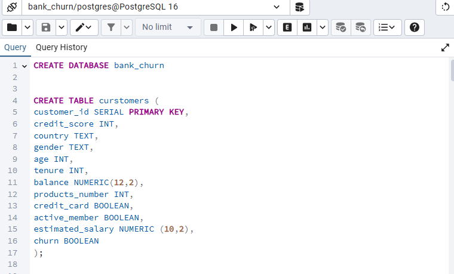
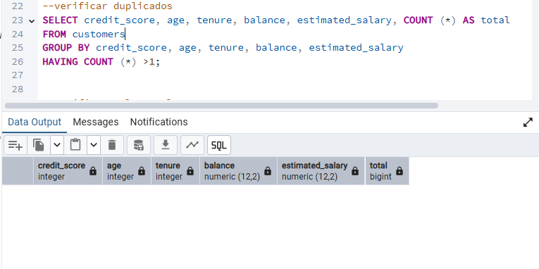
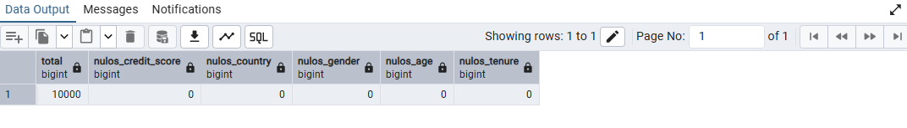
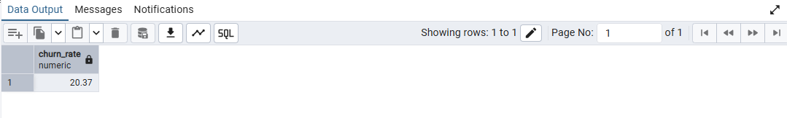
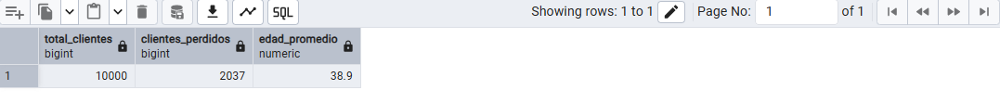
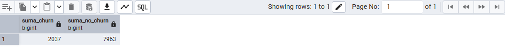
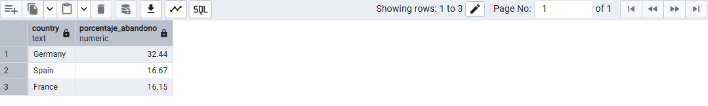
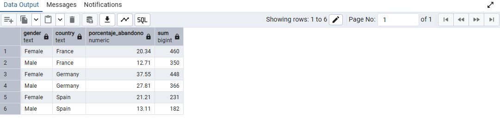
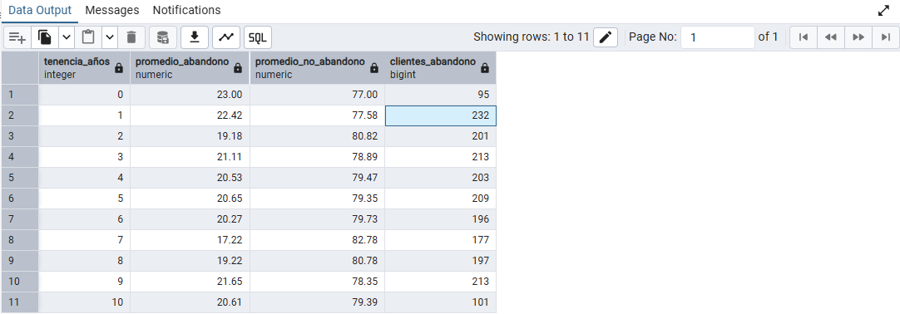
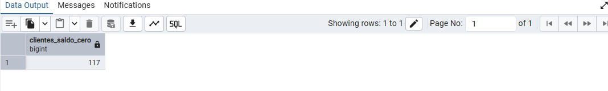

Desarrollo del Proyecto en PostgreSQL, siguiendo una secuencia lógica de exploración, limpieza y análisis.

1️⃣ Creación de la base de datos y estructura de tablas

Se definió la base de datos bank_churn y se creó la tabla customers con las principales variables del dataset:

Datos demográficos: age, gender, country

Datos financieros: balance, estimated_salary, credit_score

Comportamiento bancario: products_number, active_member, credit_card, tenure

Variable objetivo: churn (abandono del cliente)

 

2️⃣ Verificación de calidad de datos

Se realizaron validaciones para asegurar la calidad del dataset:

### Detección de duplicados

  

### Conteo de valores nulos: identificando variables con posibles vacíos en country, gender, tenure, etc.

Estos pasos garantizan una base confiable para el análisis posterior.

3️⃣ Cálculo de indicadores principales

Se elaboraron consultas para obtener los indicadores generales del comportamiento de los clientes:

## Tasa general de abandono (Churn_rate)

## Total de clientes y edad promedio

## Comparativo de clientes que abandonaron vs. los que permanecen

4️⃣ Análisis segmentado

Se desarrollaron análisis por distintas dimensiones para identificar patrones:

### Tasa de abandono promedio por pais

### Por género y país: identificación de diferencias de comportamiento.

### Por tenencia: análisis del tiempo de relación con el banco y su impacto en la retención.

5️⃣ Análisis de balance y riesgo

Se profundizó en el saldo promedio (balance) de clientes activos y no activos, y se identificaron clientes con saldo cero, considerados un riesgo potencial de abandono.

Además, se analizaron combinaciones como:

### Clientes con tarjeta de crédito y saldo cero, eran miembros activos pero aun asi abandonaron 

-- Tambien se agrupó por segmentos el nivel de score crediticio y luego se calcula el total de clientes para ese segmento
-- Adicional se calcula cuanto clientes de ese segmento abandonaron el banco y que porcentaje de abandono representa

![alt text] 

6️⃣ Preparación de vista para Power BI

Finalmente, se creó una vista limpia para conectar el modelo SQL directamente con Power BI:

CREATE VIEW vista_banca AS (
    SELECT *
    FROM customers

);

